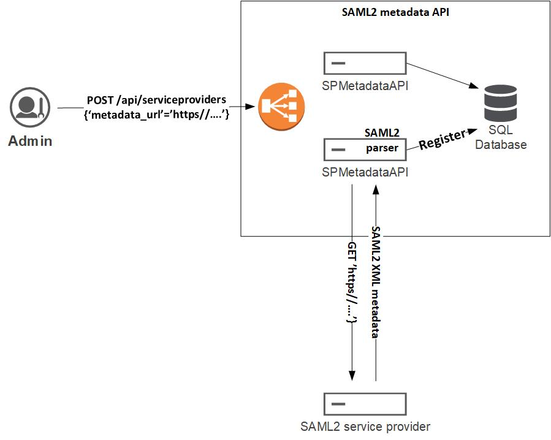

# Webservice architecture
## Overview
### Why a SAML2 metadata webservice ?
SAML2 Services Providers can be registered in a Shibboleth Identity Provider using various methods :
  * Direct edit of IDP XML configuration files (relying-party.xml, metadata files)
  * Through an file backed remote HTTP metadata provider.
  * Using a [MDQ metadata provider](https://wiki.shibboleth.net/confluence/display/SP3/MDQMetadataProvider) loading metadata on demand from an HTTP server using the conventions defined by the Metadata Query Protocol draft specification.

Direct edit of IDP XML configuration files has been described in various blog. However, this architecture is strongly discouraged in a production environment because of the following limitations :
  * High risk of XML files corruption.
  * Direct impact of registration load on IDP resources.
  * Limited horizontal scalability.

### Service provider registration

### Integration with a Shibboleth IDP

## API Platform integration
###
