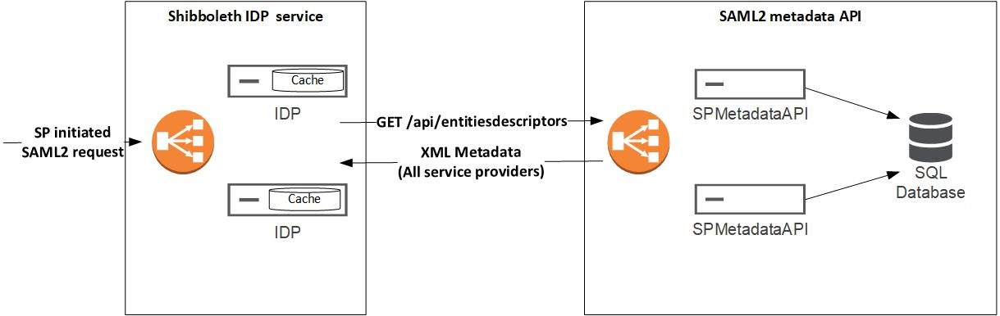
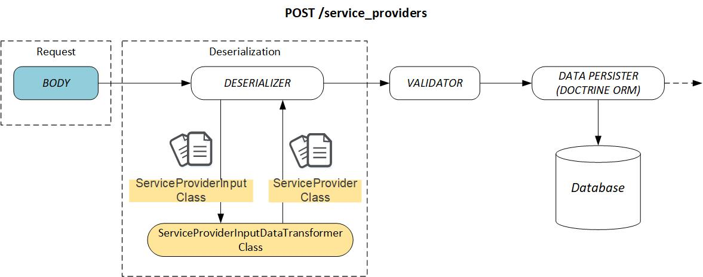
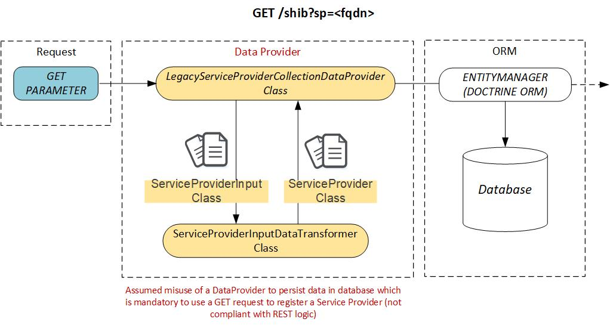
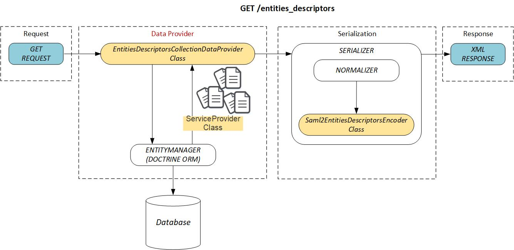

# Webservice architecture
## Overview
### Why a SAML2 metadata webservice ?
SAML2 Services Providers can be registered in a Shibboleth Identity Provider using various methods :
  * Direct edit of IDP XML configuration files (relying-party.xml, metadata files)
  * Through an **file backed remote HTTP metadata provider**.
  * Using a [MDQ metadata provider](https://wiki.shibboleth.net/confluence/display/SP3/MDQMetadataProvider) loading metadata on demand from an HTTP server using the conventions defined by the Metadata Query Protocol draft specification.

Direct edit of IDP XML configuration files has been described in various blog. However, this architecture is strongly discouraged in a production environment because of the following limitations :
  * High risk of XML files corruption.
  * Direct impact of registration load on IDP resources.
  * Limited horizontal scalability.

Shibboleth IDP configuration to use this SAML2 metadata webservice is described on [Shibboleth integration page](shibboleth.md).

### Service provider registration

### Integration with a Shibboleth IDP

## API Platform integration
### Registering SAML2 service providers
#### POST /services_providers request handling
The `POST /service_providers` endpoint is the main SAML2 Service Provider registration endpoint. Input data is either :
  * A **metadata_url** representing the URL of the service provider metadata endpoint.
  * A **shibboleth_host** representing the fully qualified name (FQDN) of a Shibboleth service provider. In this case, the URL of the service provider metadata endpoint is automatically constructed by the webservice using the `https://<shibboleth_host>/Shibboleth.sso/Metadata` pattern.

API Platform Data Transformer Object (DTO) is used to have a different representation of the ServiceProvider class as input (POST) than the one describing the data objects stored in the database or returned as a response of a GET request.

The `ServiceProviderInput` class describes the input object. The `ServiceProviderInputDataTransformer` class converts the `ServiceProviderInput` into a `ServiceProvider` object by :
  * Querying the SAML2 Service Provider metadata endpoint using either the **metadata_url** or the **https://<shibboleth_host>/Shibboleth.sso/Metadata** URL.
  * Parsing and validating the gathered XML string using the **LightSAML** SAML2 metadata parser.
  * Extracting the SAML2 Service Provider **entityId** from the parsed metadata.

#### GET /shib?sp=<fqdn> request handling
**DEPRECATED NOT REST COMPLINANT ENDPOINT, TO BE REMOVED AS SOON AS POSSIBLE**

The `GET /shib?sp=<fqdn>` endpoint is a **legacy** SAML2 Service Provider registration endpoint for bckwrad compatibility with registration scripts not implementing HTTP POST capabilities.

This endpoint **voluntarily misuses an API Platform DataProvider** to persist data in database which is mandatory to use a GET request to register a Service Provider (not compliant with REST logic).

A `ServiceProviderInput` is manually created using the provided `sp=<fqdn>` GET parameter. The `ServiceProviderInputDataTransformer` class converts the `ServiceProviderInput` into a `ServiceProvider` object by :
  * Querying the SAML2 Service Provider metadata endpoint using  **https://<sp fqdn>/Shibboleth.sso/Metadata** URL.
  * Parsing and validating the gathered XML string using the **LightSAML** SAML2 metadata parser.
  * Extracting the SAML2 Service Provider **entityId** from the parsed metadata.

The `ServiceProvider` is then persisted in database using a Doctrine ORM `EntityManagerInterface`.

### Gathering the aggregated metadata XML file
Aggregated SAML2 Metadata is provided to the Shibboleth IDP accessing the webservice using a [FileBackedHTTPMetadataProvider](shibboleth.md) through the `GET /entities_descriptors` API endpoint.

The `GET /entities_descriptors` endpoint serializes the `ServiceProvider` objects extracted from the database by the `EntitiesDescriptorsCollectionDataProvider` sing a Doctrine ORM `EntityManagerInterface` into a custom **saml2ed** API Platform format using the `Saml2EntitiesDescriptorsEncoder`.

The `Saml2EntitiesDescriptorsEncoder` leverages `LightSaml\Model\Metadata\EntitiesDescriptor` class to :
  * Build an **EntitiesDescriptors XML container element** containing all the SAML2 metadata EntityDescriptor nodes, each node representing a single SAML2 Service Provider.
  * **Set the validity** of the generated EntitiesDescriptors object.
  * **Sign** the generated EntitiesDescriptors container to establish a chain of trust between the SAML2 metadata webservice and the Shibbleth IDP by allowing the IDP to check metadata file integrity before using it as a SAML2 metadata reference.

## Reference
  * [Using Data Transfer Objects (DTOs)](https://api-platform.com/docs/core/dto/)
  * [Doctrine ORM EntityManager](https://www.doctrine-project.org/api/orm/latest/Doctrine/ORM/EntityManager.html)
  * [OASIS SAML2 metadata specifications](https://www.oasis-open.org/committees/download.php/51890/SAML%20MD%20simplified%20overview.pdf)
